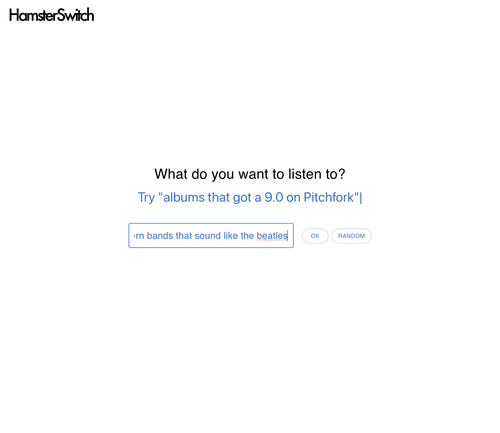
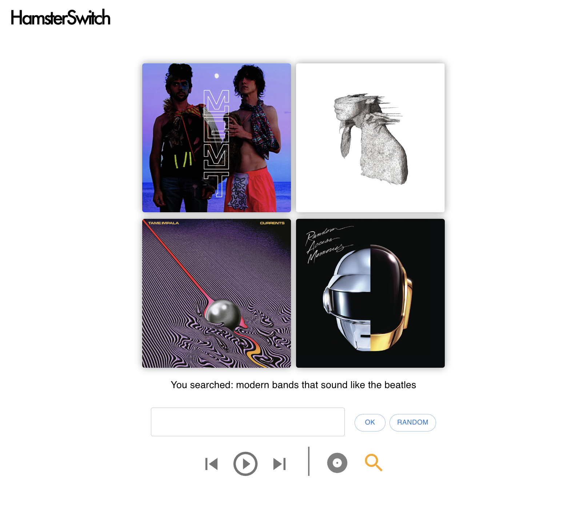
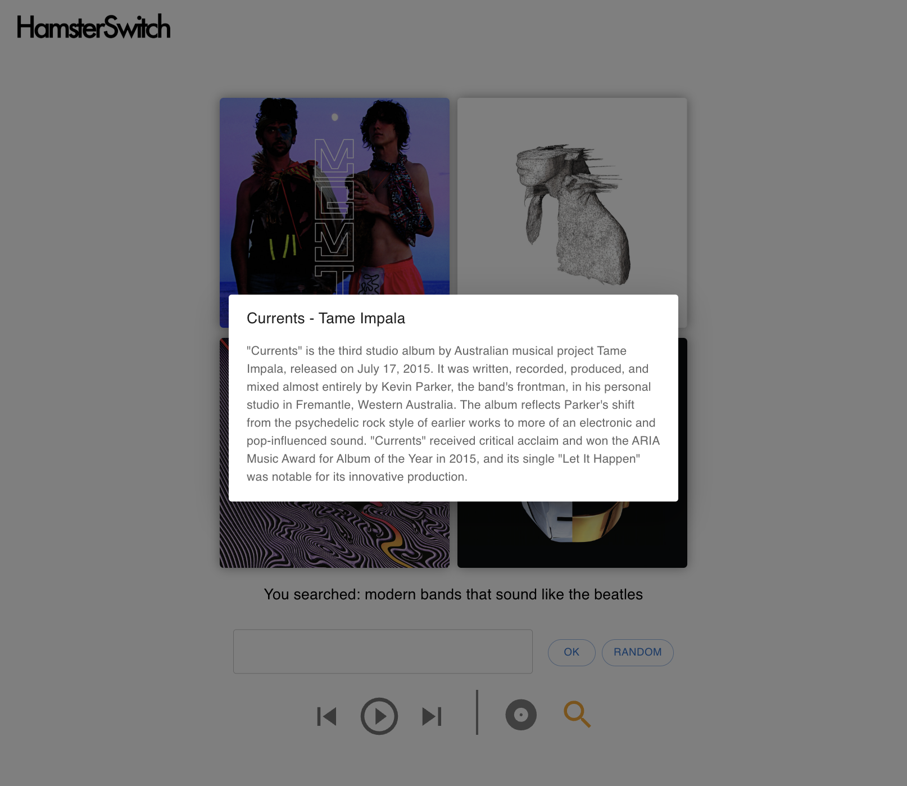
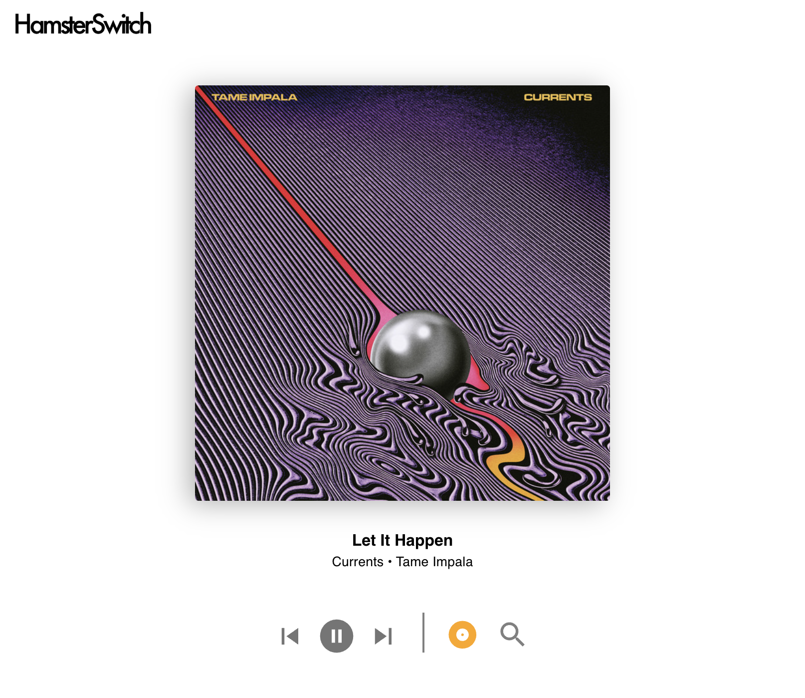

# Hamster Switch

## Overview

Hamster Switch connects Spotify with ChatGPT, providing music recommendations based on free-form text requests, with the ability to play music directly from the app. 

The goal is to help you actively discover new music outside the bubble of algorithms based on your existing listening habits. The UI centers around album covers to try to capture some of the fun of flipping through a stack of records.

## 📹 Demo









## 📂 Repositories

This project is split across two repositories:

- **Frontend**: [hamsterswitch-frontend](https://github.com/grossandrewr/hamsterswitch-frontend)
- **Backend**: [hamsterswitch-api](https://github.com/grossandrewr/hamsterswitch-api)

> **Note**: You are currently viewing the Backend repository. 

## 🛠️ Technologies

### Frontend
- JavaScript
- React.js
- Material UI
- Spotify Web Playback SDK

### Backend
- Node.js
- Express
- OpenAI API


## 🚀 Installation & Setup

### Backend Setup

1. Clone the backend repository:
   ```bash
   git clone https://github.com/grossandrewr/hamsterswitch-api.git
   cd hamsterswitch-api
   ```

2. Install dependencies:
   ```bash
   npm install
   ```

3. Create a `.env` file with required variables:
   ```
   OPENAI_API_KEY=your_openai_api_key
   ```

4. Start the backend:
   ```bash
   npm start
   ```

### Frontend Setup

1. Clone the frontend repository:
   ```bash
   git clone https://github.com/grossandrewr/hamsterswitch-frontend.git
   cd hamsterswitch-frontend
   ```

2. Install dependencies:
   ```bash
   npm install
   ```

3. Create a `.env` file with required variables:
   ```
    OPENAI_API_KEY=your_api_key
   ```

4. Start the frontend:
   ```bash
   npm start
   ```

5. The app should now be running with the frontend on `localhost:3000` and backend on `localhost:8000`


## 📧 Contact

- GitHub: [grossandrewr](https://github.com/grossandrewr)
- Email: andrewgross.swe@gmail.com

